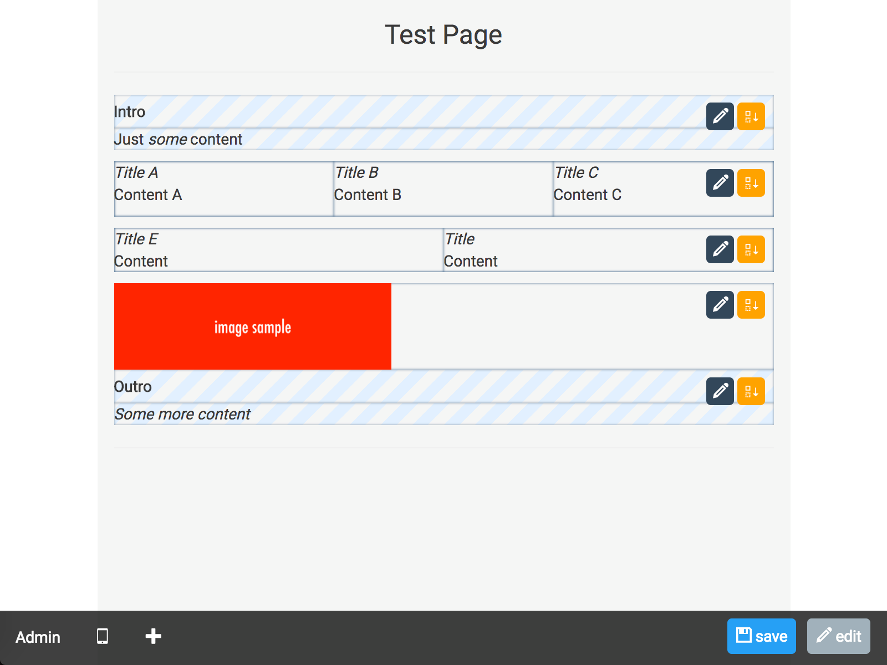

# EditableComponents for Rails

A Ruby on Rails plugin to manage UI components editable from the front-end.

_NOTE_: this is an **ALPHA** version, major changes could happens.

Goals:

- attach the necessary data to a model transparently

- edit the UI contents directly from the pages

- simplify the components development in views



### Instructions

1. Add to the Gemfile: `gem 'editable_components'`

2. Copy migrations (Rails 5.x syntax, in Rails 4.x use rake): `rails editable_components:install:migrations`

3. Apply them: `rake db:migrate`

4. Include the concern *Editable* to your model: `include EditableComponents::Concerns::Editable`

5. Add to your application layout (in head, ex. using ERB): `<%= stylesheet_link_tag( EditableComponents::Engine.css ) if EditableComponents::Engine.css %>`

6. Add to your application layout (before body closing): `<%= javascript_include_tag( EditableComponents::Engine.js ) if EditableComponents::Engine.js %>`

7. Add your blocks to the views (ex. in show):
```erb
<%= render layout: 'editable_components/blocks', locals: { container: @page } do |blocks| %>
  <% blocks.each do |block| %>
    <%= render partial: "editable_components/block", locals: { block: block } %>
  <% end %>
<% end %>
```

8. Add some sample data (ex. Page model): `Page.first.create_block :text`

##### Images

To add support for images add CarrierWave gem to your Gemfile and execute: `rails generate uploader File`

### Notes

- This is not a complete replacement for an admin interface but it could improve the usability of a CMS software or content editor

### Dev Notes

##### Structure

- Including the Editable concern to a model will add `has_many :ec_blocks` relationship (the list of blocks attached to a container) and some utility methods

- Block: an editable UI component (ex. a text with a title, a slider, a 3 column text widgets, etc.); built with a list of sub blocks (for nested components) and a list of items

- Item: a single piece of information (ex. a string, a text, a boolean, an integer, a file, etc.)

- The live editing interface uses VueJS

## Contributors

- [Mattia Roccoberton](http://blocknot.es) - creator, maintainer
